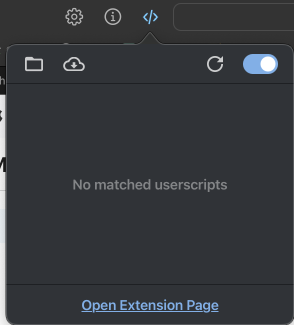
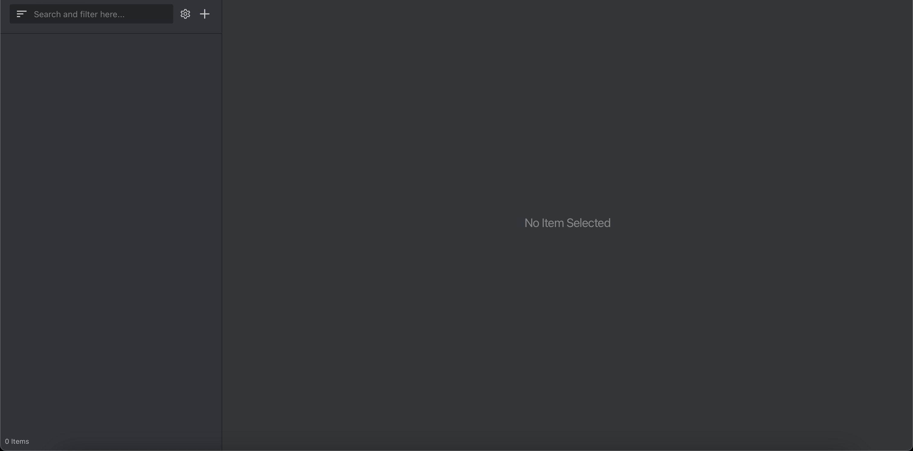
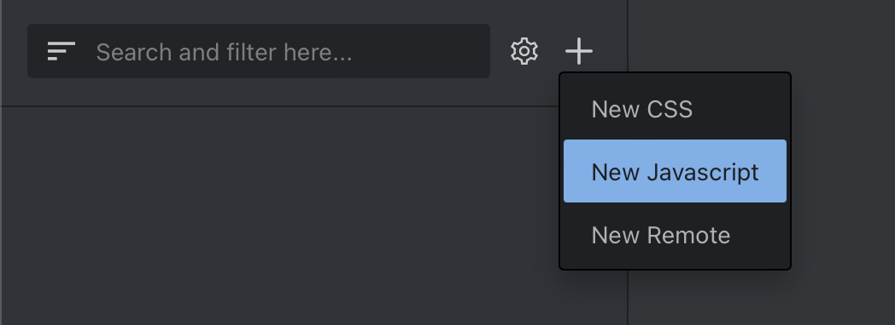
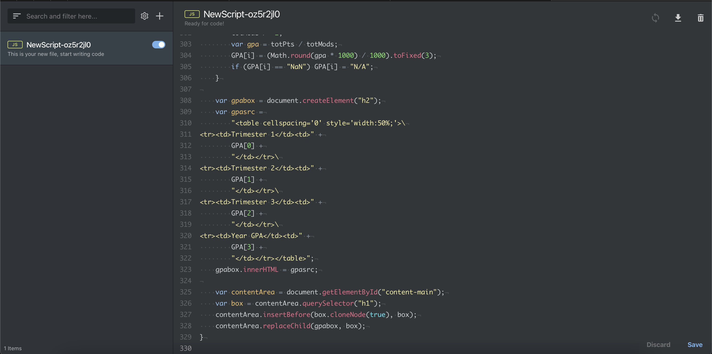
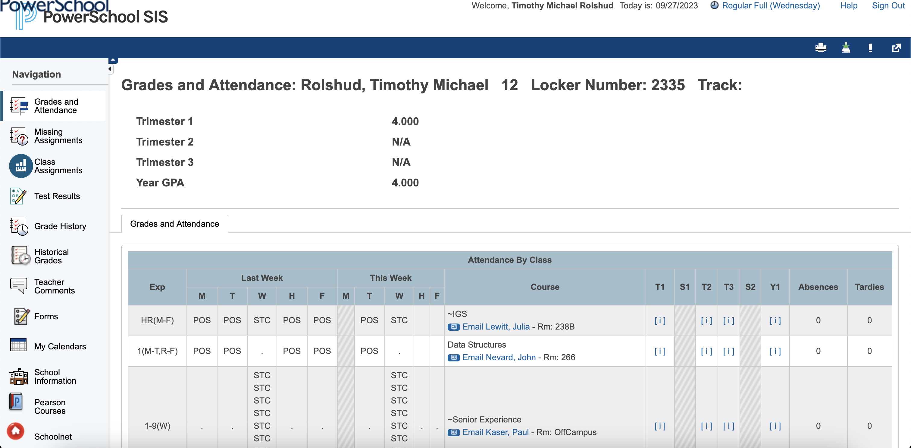
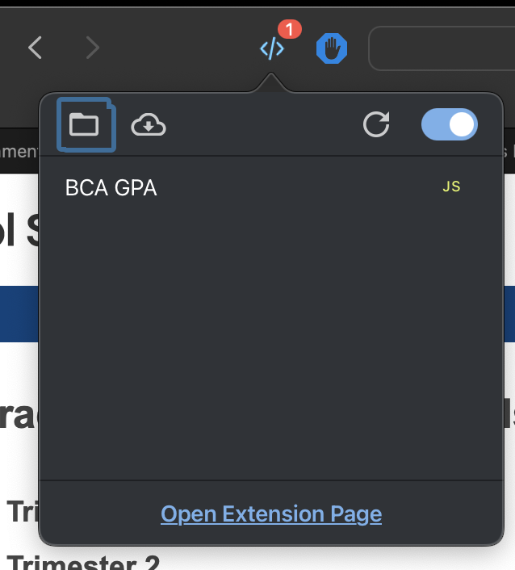

# Using BCA GPA on Safari

BCA GPA is not available as an extension for Safari yet, but here is a method of achieving the same functionality as on Chrome or Firefox:

-   Install the [Userscripts](https://apps.apple.com/ua/app/userscripts/id1463298887) extension for Safari through the Mac App Store
    -   we will use this to run BCA GPA on Powerschool
    -   this extension works exactly like Greasyfork or Tampermonkey and lets you run your own scripts on websites.
-   Add the Userscripts extension to the toolbar, click on the icon and go to "Open Extension Page"
    
-   You should then be brought to a page like this:
    
-   Use the menu to add a new Javascript script
    
-   Copy and paste everything from [this link](https://raw.githubusercontent.com/kna27/bca-gpa-2023/main/SAFARI/BCAGPA.js) and replace everything in the textbox with what you copied, it should look like this:
    
-   Make sure to hit "Save" at the bottom right of the screen to apply the changes in the userscript settings.
-   Reload or visit the Powerschool page and you should see your GPA there. It should look like this:
    
-   If you don't see it, make sure that the Userscript is activated in the menu, it should look like this:
    
